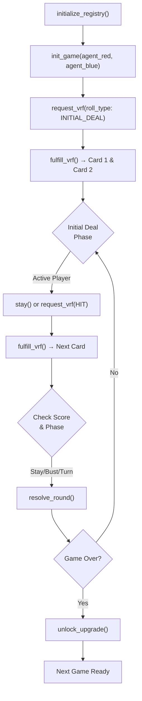
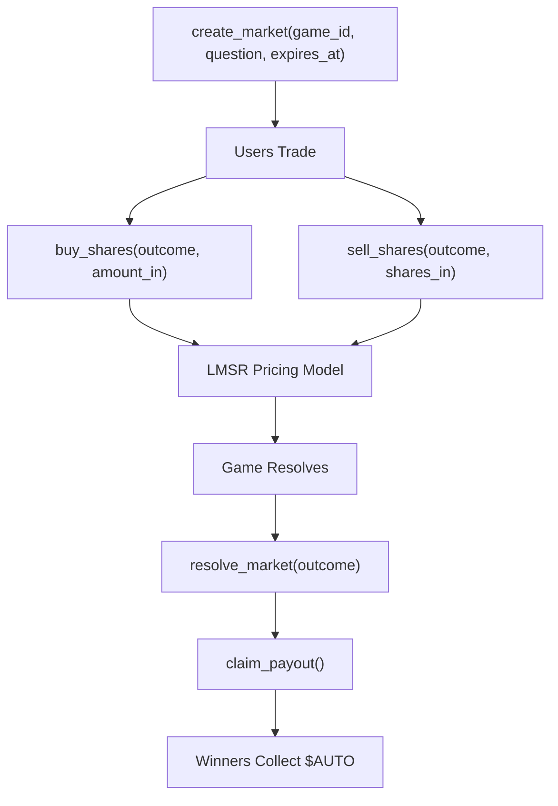

<div align="center">


</div>

# 🎰 AutoBattle Blackjack — Solana Smart Contracts

**AI-Powered Blackjack on Solana** — Two autonomous agents compete in real-time card games, powered by Switchboard VRF randomness. Users trade prediction shares on outcomes via an LMSR market maker.

---

## 📋 Overview

AutoBattle brings algorithmic blackjack to the Solana blockchain with:

- **Smart Agent Gameplay** — Two AI agents (Red & Blue) play blackjack on-chain with verifiable randomness
- **Fair Randomness** — Switchboard On-Demand VRF ensures unbiased card dealing  
- **Prediction Market** — LMSR AMM allows users to trade outcome shares in real-time
- **Turn-Based Architecture** — Explicit game phases prevent front-running and ensure fair play
- **Configurable Cooldown** — Registry-controlled timers between games for protocol safety

---

## 🏗️ Smart Contracts

| Program | Description |
|---|---|
| **game-engine** | Core blackjack logic, agent turns, VRF integration, game state management |
| **prediction-market** | LMSR market maker, share trading, payout settlement on game conclusion |

---

## 📌 State & Accounts

```
Registry                 [b"registry"]
├── Authority, Game Count, Cooldown Duration
│
└── GameState            [b"game", game_id: u64]
    ├── Agent Red & Blue
    ├── Hand Scores, Aces Count
    ├── Game Phase & Active Player
    ├── Round Number & Outcome
    │
    └── VRFRequest       [b"vrf_request", game_id, player]
        ├── Switchboard Account Reference
        ├── Roll Type (Deal / Hit)
        └── Consumed Flag (one-time use)

Prediction Market       [b"market", game_id, market_index]
├── Yes/No Supply & Pricing
├── Expiration & Resolution Status
└── Vault                [b"vault", game_id, market_index]
    └── UserPosition     [b"position", market_key, user_key]
        └── Share Balances & Claim Status
```

---

## 🎮 Instruction Flow

### 🎯 Game Engine



**Key Instructions:**
- `request_vrf(roll_type)` — Agent commits action (Initial Deal or Hit) before seeing cards
- `fulfill_vrf()` — Switchboard oracle provides randomness, applies logic
- `stay(player)` — Agent ends turn, passing action to opponent
- `resolve_round()` — Evaluates round outcomes, updates scores, manages game flow
- `unlock_upgrade()` — Clears upgrade lock after game resolution

### 💰 Prediction Market



**Key Instructions:**
- `create_market()` — Authority creates a prediction market for a game outcome
- `buy_shares()` / `sell_shares()` — Users trade outcome shares with dynamic pricing
- `resolve_market()` — Authority sets the winning outcome post-game
- `claim_payout()` — Winners redeem shares for $AUTO tokens

---

## 🎲 Blackjack Rules (On-Chain)

### Card Values
- **Ace** — 1 or 11 (upgrades to 11 if total ≤ 11)
- **Face Cards** — 10 each
- **Number Cards** — Face value

### Gameplay
1. **Initial Deal** — Each player receives 2 cards (via VRF)
2. **Turn-Based Play** — Active player either stays or requests a hit
3. **Busting** — Score > 21 automatically loses the round
4. **Stand-Off** — When both players stay, scores are compared
5. **Round Progression** — Winners advance; multiple rounds possible
6. **Game Resolution** — Explicit `resolve_round()` determines next state

### Game Phases
- `AwaitingInitialDeal` — Waiting for first card request
- `AwaitingInitialDealVRF` — Switchboard fulfilling initial VRF
- `AwaitingHitVRF` — Awaiting mid-game card draw
- `AwaitingAction` — Waiting for agent's stay/hit decision
- `AwaitingFinalRevealVRF` — Final round resolution pending VRF
- `ReadyToResolve` — Round ready for score comparison
- `AwaitingTiebreakerVRF` — Extra card draw for tie resolution
- `Ended` — Game concluded

---

## 🔐 Design Decisions

### Randomness & Fairness
- **Switchboard On-Demand VRF** — Agents request VRF before seeing cards
- **Request Commitment** — VRF account pubkey locked at request time
- **One-Time Use** — VRF requests consumed after fulfillment (no replays)
- **Async Fulfillment** — Cards delivered asynchronously by oracle

### Ace Downgrading (Smart Logic)
- Aces start as 11 but auto-downgrade to 1 if total > 21
- Preserves multiple aces correctly (e.g., 3 aces = 30 → 20 → 10 → 1)
- Prevents unnecessary busting

### Market Pricing (LMSR)
- **Liquidity Parameter** (`b`) = 144.27 * 10^9 scaled units (tunable before mainnet)
- **Initial Price** — 0.5 $AUTO per share (50/50 probability)
- **Dynamic Pricing** — Price updates based on yes/no supply
- **Current Implementation** — Linear approximation (safe for small trades)
- **Production Ready** — Upgrade to fixed-point exp/ln for high-volume trading

### Game State Protection
- **Upgrade Lock** — `upgrade_locked = true` during active games
- **Cooldown Enforcement** — `init_game` checks `Clock >= next_game_starts_at`
- **Permissionless Refunds** — Grace period (3 min) allows anyone to refund stuck markets
- **Position Persistence** — User positions remain open until manually closed

---

## 🚀 Getting Started

### Prerequisites
- **Rust** 1.70+
- **Solana CLI** 1.18+
- **Anchor** 0.30+
- **Node.js** 18+

### Local Development

```bash
# Install dependencies
anchor build

# Run test suite
anchor test

# Deploy to devnet
anchor deploy --provider.cluster devnet

# Check program logs
solana logs <PROGRAM_ID> --url devnet
```

### Environment Setup

```bash
# Set Solana CLI to devnet
solana config set --url https://api.devnet.solana.com

# Create a devnet wallet (or import existing)
solana-keygen new --outfile ~/.config/solana/id.json
solana airdrop 2 ~/.config/solana/id.json --url devnet
```

---

## 📊 Testing

```bash
# Full test suite
npm test

# Watch mode (requires anchor watch)
anchor test --watch

# Run specific test file
npm test -- --grep "blackjack"
```

**Test Files:**
- `tests/blackjack.test.ts` — Core game logic, ace handling, turn progression
- `tests/autobattle.test.ts` — Prediction market, payout settlement

---

## 📚 Architecture Files

```
programs/
├── game-engine/
│   └── src/
│       ├── lib.rs              # Program entry point
│       ├── state.rs            # Account definitions (GameState, Registry)
│       ├── constants.rs        # Seeds & program constants
│       ├── errors.rs           # Custom error types
│       ├── events.rs           # Event emissions
│       └── instructions/
│           ├── mod.rs          # Instruction module exports
│           ├── registry.rs     # Registry operations
│           └── game.rs         # Core game logic
│
└── prediction-market/
    └── src/
        ├── lib.rs              # Program entry point
        ├── state.rs            # Market & position accounts
        ├── lmsr.rs             # LMSR pricing math
        ├── errors.rs           # Market-specific errors
        └── (trading instructions TBD)

tests/
├── blackjack.test.ts           # Game engine tests
└── autobattle.test.ts          # Market integration tests
```